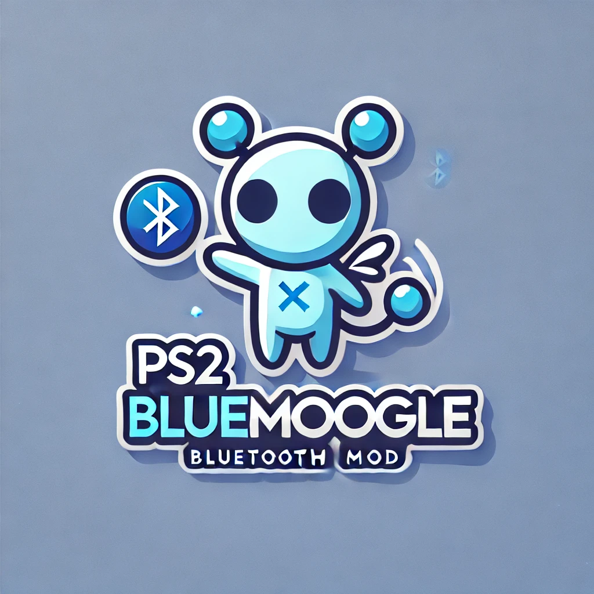

# PS2 BlueRetro Mod - BlueMoogle

This project adds Bluetooth connectivity for PlayStation 2 controllers, based on the BlueRetro project. The goal is to integrate this functionality directly into the PlayStation 2 as a hardware mod.

## Project Status

The project is currently in the **Prototype v2** phase. Prototype v1 has been successfully tested, enabling the definition of all remaining pin configurations. The schematic for v2 is complete, and the PCB design is in progress. Testing of Prototype v2 has commenced.

### Prototype v2 Features

- Integration with PlayStation 2 Controller Ports.
- Final hardware functionalities implemented.
- Addition of a buzzer for user feedback.
- External wiring for connection to the PlayStation 2 (v2 is not yet designed for direct integration into the console).
- Detection of console power supply.
- Reading and control of the boot (system reset) signal, including a buffer for optional signal reading by the firmware.
- LED control and buzzer functionality tested and operational.

Firmware adjustments will be necessary to support the new hardware setup.

## Known Issues and Ongoing Work

- **Controller Port Connection Detection**: Currently, detecting whether a wired controller is connected is not functioning as expected. The voltage at the pins is read correctly, but no change is detected when a controller is plugged in. However, grounding the pin directly triggers a change. This suggests insufficient current draw from the controller. Adjusting the resistor in the current mirror is planned to resolve this issue. Simulation shows promising results.
- **Buffer Enable Pin**: The enable pin of the buffer must be pulled high to allow easy flashing of the board after the BlueRetro firmware is installed. Currently, the buffer prevents flashing due to the boot pin being repurposed as the reset pin in BlueRetro firmware.

## Next Steps

1. Correctly dimension the controller port detection circuitry.
2. Verify that controller signals are correctly forwarded to the console.
3. Produce the first production sample using a flex PCB for direct console integration.

## Hardware Version

This project modifies the [BlueRetro HW2](https://github.com/darthcloud/BlueRetro/wiki#2---building-hardware-hw2) design, adapted for integration as a PlayStation 2 mod with external controller detection capabilities.

## Firmware

Currently, the firmware is based on [BlueRetro](https://github.com/darthcloud/BlueRetro). A testing firmware is available in the `pcb-testing` branch within the `firmware` folder of this repository. Custom modifications are being made to accommodate the unique hardware setup.

### Flashing Instructions

To flash the firmware, follow these steps:

1. Install the USB UART bridge driver if necessary (available through Windows Update).
2. Press and hold the boot button on the board.
3. Briefly press the EN (Reset) button while still holding the boot button.
4. Continue holding the boot button for a moment longer, then release.

> Note: The boot button must be pressed when the board powers on or resets to enable flashing.

For detailed flashing instructions, refer to [Flashing Firmware on Windows 10](https://github.com/darthcloud/BlueRetro/wiki/Flashing-firmware-Windows-10). This guide provides important memory area configurations.

The latest firmware binary can be downloaded here: [BlueRetro Firmware](https://darthcloud.itch.io/blueretro). For this prototype, the **HW1 Universal** firmware was used.

## Controller Pairing

To pair a PS3 controller, follow the [PS3 Pairing Guide](https://github.com/darthcloud/BlueRetro/wiki/Controller-pairing-guide#2---ps3-pairing-guide). The **Sixaxis Pair Tool** is required to set the Bluetooth master for the controller. Download it here: [Sixaxis Pair Tool](https://sixaxispairtool.en.lo4d.com/windows#:~:text=The%20Sixaxis%20Pair%20Tool%20is,games%20with%20your%20PS3%20controller).

The Bluetooth MAC address of the BlueRetro board can be located in the advanced settings of the web configuration.

### BlueRetro Web Configuration

To access BlueRetro’s web configuration, a BLE-enabled Bluetooth adapter is required. You can access it here: [BlueRetro WebConfig](https://blueretro.io/).

For Brave browser users: Bluetooth web configuration may need to be enabled in the settings under `brave://flags`.

## Acknowledgments

This project is based on the [BlueRetro project](https://github.com/darthcloud/BlueRetro), which provides the foundation for Bluetooth connectivity with classic gaming consoles.
